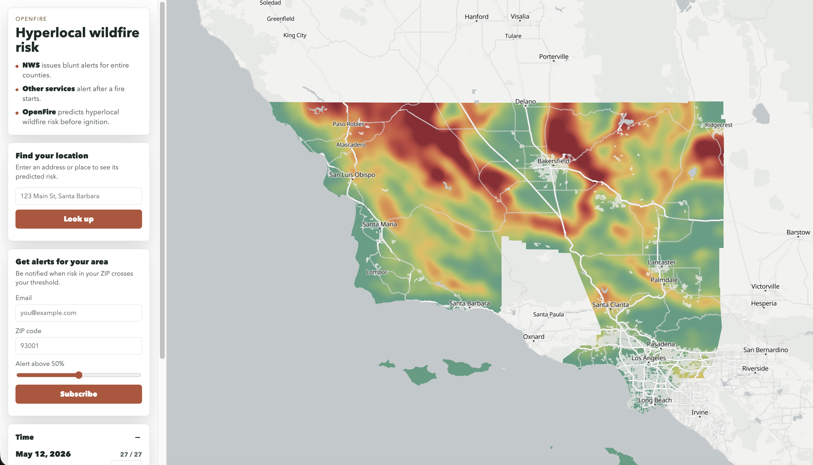

# OpenFire

A geospatial ML platform that predicts wildfire risk across four Southern California counties on a 1 km grid, refreshes its outlook every five days, and serves the latest map to a live web UI.



**[View the live map →](https://openfire-ui-socal-clip-222683846563.us-central1.run.app/)**

---

## What it does

- Ingests Sentinel-2 reflectance, gridMET weather, USGS topography, and Cal Fire FRAP burn perimeters via Google Earth Engine.
- Engineers ~38 features per 1 km cell in BigQuery, including 5/15/30/60-day lag deltas for vegetation indices, temperature, and precipitation.
- Trains an XGBoost classifier on the four-county SoCal grid with a temporal (year-based) holdout, tracked in MLflow.
- Runs end-to-end inference on a Cloud Scheduler trigger, writing predictions to BigQuery and zoom-tiered GeoJSON snapshots to GCS.
- Serves the latest snapshot to a Leaflet / MapLibre web UI through a same-origin GCS proxy — the browser never touches the bucket directly.

---

## Architecture


Two pipelines share one set of contracts: a batch training pipeline that builds a versioned Parquet snapshot of the gold feature table, and a windowed inference pipeline that re-engineers one 5-day window, scores it, and publishes prediction artifacts. See [`docs/ARCHITECTURE.md`](docs/ARCHITECTURE.md) for the full diagram, data contracts, and a component-by-component breakdown.

---

## Stack

| Layer    | Tech |
| -------- | ---- |
| Data     | Google Earth Engine, BigQuery (partitioned + clustered tables, Parquet export to GCS), GeoJSON |
| ML       | XGBoost, scikit-learn, MLflow (experiment tracking + model registry) |
| Serving  | FastAPI, Cloud Run (Jobs for batch, Services for HTTP), Cloud Scheduler |
| Frontend | Leaflet / MapLibre GL, deck.gl prototype, vanilla JS (no build step) |
| Infra    | Docker, GitHub Actions CI/CD, Artifact Registry |
| Quality  | pytest, Evidently drift reports, browser performance telemetry to BigQuery |

---

## Engineering decisions worth a look

- **Temporal train/holdout, never random.** Spatial and temporal autocorrelation make random splits leaky; year-based holdouts preserve the time-series structure of fire seasons.
- **Pinned 1 km grid asset with a row-count invariant.** Inference must produce exactly 65,687 gold rows and exactly 65,687 prediction rows before any write fires — silent grid drift is caught at the boundary, not in production.
- **`predictions_history` partitioned by date, clustered by integer `lat_bin` / `lon_bin`.** BigQuery cannot cluster on `FLOAT64`, so latitude/longitude are bucketed at table create time. Pruning and clustering still work for spatial queries.
- **Monotonic `manifest.json`.** Older-window reruns update the sorted `windows` index without regressing the frontier the frontend reads. Reprocessing the past never breaks the present.
- **`days_since_last_burn = 9999` is a categorical magic value, not a number.** XGBoost handles it natively; imputing or normalizing would smear two very different signals together.
- **Three-tier model resolution: GCS → MLflow registry → local.** Serving stays up if MLflow is unreachable, and local mode keeps dev tight.
- **Zoom-tiered GeoJSON snapshots (`full`, `z8`, `z9`).** The frontend picks the right LOD per zoom level instead of asking the browser to parse 65k features at world view.

---

## Quickstart

```bash
# Clone and set up
git clone https://github.com/tkovalcik/openfire && cd openfire
python -m venv .venv && source .venv/bin/activate
pip install -e .

# GCP credentials and env
gcloud auth application-default login
cp .env.example .env   # populate GCP_PROJECT_ID, OPENFIRE_GCS_BUCKET, MLFLOW_TRACKING_URI, ...

# Plan one inference window without touching anything
python -m src.pipelines.run_inference_pipeline --mode latest --dry-run

# Catch up to the most recent unprocessed window
python -m src.pipelines.run_inference_pipeline --mode latest
```

Full deployment, training, and Cloud Run operational details live in [`docs/RUNBOOK.md`](docs/RUNBOOK.md).

---

## Repo layout

```text
data_pipelines/        Numbered SQL + Python that build silver/gold features and inference tables (01–08)
src/
  pipelines/           Training and inference orchestrators, BQ helpers, output writer, monitor
  model/               XGBoost training entry point and registry helpers
  serving/             FastAPI app and model loader with explicit source precedence
  ui_socal/            FastAPI service that serves the SoCal frontend and proxies GCS
  monitoring/          Evidently report writers and report-browser dashboard
  common/              Storage client and path helpers
docker/                One Dockerfile per service (api, inference, train, ui, monitoring)
frontend-socal/        Static Leaflet UI (current production)
frontend-socal-deckgl/ Static deck.gl UI prototype
docs/                  Architecture, runbook, design notes
.github/workflows/     CI, CD, scheduled jobs
tests/                 pytest suite
```

---
