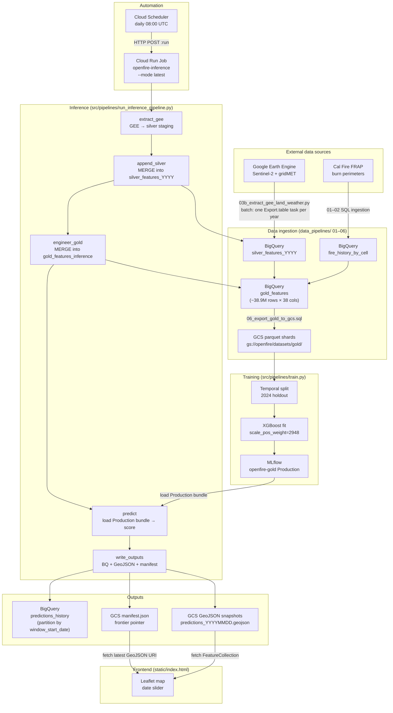

# OpenFire Architecture

End-to-end data flow, component responsibilities, and the key design decisions behind the capstone ML pipeline.

---

## System overview



---

## Component responsibilities

### Data ingestion (`data_pipelines/`)

| Script | What it does |
|---|---|
| `01_create_fire_history.sql` | Ingests FRAP burn perimeters into `fire_history_by_cell` |
| `02_create_fire_history_by_cell.sql` | Aggregates fire dates per 1 km cell |
| `03b_extract_gee_land_weather.py` | GEE Python API: submits per-year batch export tasks → `silver_features_YYYY_gee_import` |
| `04_merge_silver_years.sql` | Wildcard-reads all silver import tables, deduplicates on `(lat, lon, timestamp)`, LEFT JOINs fire labels → `silver_features_all_years` |
| `05_engineer_gold_features.sql` | Computes lag-delta features (NDVI/NDWI/temp/precip change over 5/15/30/60 days) using BQ `LAG` partitioned by `CAST(latitude AS STRING)` → `gold_features` |
| `06_export_gold_to_gcs.sql` | Exports `gold_features` as SNAPPY Parquet shards to `gs://openfire/datasets/gold/` |

**Key gotchas:**
- `PARTITION BY` uses `CAST(latitude AS STRING)` — BigQuery rejects FLOAT64 partition keys.
- `system:index` is excluded via `EXCEPT` in step 04 — GEE injects this column and it must not land in the feature table.
- S2 masked pixels are exported as `-9999`, not NULL (GEE float sentinel).
- Rows where `ndvi_change_60d IS NULL` are filtered out to remove the 60-day lag warm-up at the start of each cell's time series.

### Training (`src/pipelines/train.py`)

Reads gold Parquet shards from GCS with per-shard column selection and float32 downcast (keeps peak memory under 32 GiB on Cloud Run). Temporal year split: default holdout 2024. XGBoost with `scale_pos_weight = negatives / positives` (≈ 2948 for this dataset). Saves a `model.joblib` bundle in the format defined in `CLAUDE.md` and registers it as `openfire-gold` in MLflow.

**Divergence from inference:** Training reads the full 38-column `gold_features` table (all years). Inference reads `gold_features_inference`, a separate table populated per-window by the inference pipeline. The two tables have the same schema; they are never merged to protect the training table from accidental inference writes.

### Inference orchestrator (`src/pipelines/run_inference_pipeline.py`)

Three modes, one pipeline:

| Mode | When to use |
|---|---|
| `--mode latest` | Default for Cloud Scheduler. Self-determining: queries `MAX(window_start_date)` from `predictions_history` and catches up to the most recent 5-day grid date before today (UTC). No-ops cleanly if up to date. |
| `--mode backfill --start YYYY-MM-DD --end YYYY-MM-DD` | Initial population or re-processing a historical range. |
| `--mode window --date YYYY-MM-DD` | Exactly one grid-aligned date. Used for smoke tests and manual reruns. |

Per-window step chain (all steps are idempotent):

```
extract_gee → append_silver → engineer_gold → load_model → predict → write_outputs → log_summary
```

**`--from-step` catch-up pattern:** When GEE silver extraction is already done (e.g., run via `03b_extract_gee_land_weather.py` in batch, or after a previous partial run), skip the slow GEE steps:
```bash
python -m src.pipelines.run_inference_pipeline \
  --mode backfill --start 2026-01-07 --end 2026-04-17 \
  --from-step engineer_gold
```
Per-window cost drops from ~15 min (with GEE) to ~40 s (gold engineering + predict + write only).

### Output writer (`src/pipelines/output_writer.py`)

Three idempotent sinks per window:

1. **`predictions_history` (BigQuery)** — partition-scoped `WRITE_TRUNCATE` on `window_start_date`. Re-running the same window replaces only that window's rows; other partitions are untouched.
2. **GeoJSON snapshot (GCS)** — `gs://openfire/predictions/predictions_YYYYMMDD.geojson`. FeatureCollection with `risk_probability`, `predicted_label`, `window_start_date`, `model_version` per point. Coordinate precision capped at 5 decimal places.
3. **`manifest.json` (GCS)** — pointer to the latest snapshot. **Monotonic:** `update_manifest` reads the existing manifest and refuses to regress the `latest_window_start_date` pointer. A re-run on an older window (e.g., a manual single-window rerun after a backfill) logs a structured WARNING and no-ops rather than overwriting the frontier. Same-window re-runs always write through so `model_version`/`updated_at` refresh after a model promotion.

### Frontend (`static/index.html`)

Static Leaflet map. On load: fetches `manifest.json` to find the latest GeoJSON URI, then fetches the GeoJSON and renders risk probability as a choropleth. Date slider navigates between available snapshots. No build step; served directly from GCS or a static host.

---

## Cloud infrastructure

| Resource | Purpose | Config |
|---|---|---|
| Cloud Run Job `openfire-inference` | Runs the inference orchestrator | 4 vCPU / 16 GiB, `max-retries=0`, `parallelism=1` |
| Cloud Run Job `openfire-train` | Runs training | 8 vCPU / 32 GiB, `max-retries=0` |
| Cloud Run Service `openfire-api` | FastAPI serving (Sebastian's infrastructure) | Managed by `cd.yml` |
| Cloud Scheduler `openfire-inference-daily` | Triggers inference | `0 8 * * *` UTC, `--mode latest` |
| MLflow server | Experiment tracking + model registry | Compute Engine `e2-small`, SQLite backend, `http://34.58.62.126:5000` |
| BigQuery dataset `openfire_features` | All tables | `msds603-mlops-project` |
| GCS bucket `openfire` | Parquet shards, GeoJSON snapshots, manifest, MLflow artifacts | `gs://openfire/` |

**Scheduler SA note:** `openfire-scheduler` has `roles/run.invoker` scoped to the `openfire-inference` job. The Cloud Run Job's default args are baked to `--mode latest`. Do **not** add an `overrides` block to the Scheduler HTTP body without also granting `run.jobs.runWithOverrides` — `roles/run.invoker` does not include it.

---

## Training vs. inference divergence

| Concern | Training | Inference |
|---|---|---|
| Feature source | GCS Parquet shards (full gold table, all years) | `gold_features_inference` BQ table (per-window MERGE) |
| Write to `gold_features` | `CREATE OR REPLACE TABLE` (safe: deliberate full recompute) | Never touches `gold_features` (read-only) |
| GEE extraction | Batch, all years in one job (`03b_extract_gee_land_weather.py`) | Per-window inline (`src/pipelines/extract_gee.py`) |
| Date range | Full 2017–2025 history (plus holdout year) | One 5-day window at a time |
| Model output | `model.joblib` bundle saved to GCS + MLflow registry | Predictions written to `predictions_history` + GeoJSON |

---

## Known limitations and model card disclosures

See `docs/PROGRESS.md § Model card disclosures` for the authoritative list. Summary:

- **FRAP label staleness:** `days_since_last_burn` uses fire perimeters through 2024-12-31. Cells that burned in 2025+ appear unburned to the model.
- **Single-year validation:** 2024 is the only holdout year; no confidence interval on metrics.
- **AOI scope:** Four SoCal counties only. Out-of-AOI predictions are out-of-distribution.
- **Resolution:** 1 km grid. Future versions planned at 250 m → 20 m.
- **`predictions_history` clustering:** Table is partitioned by `window_start_date` but not clustered by `latitude`/`longitude`. Spatial queries scan the full partition. Revisit before the table grows past ~100M rows.
