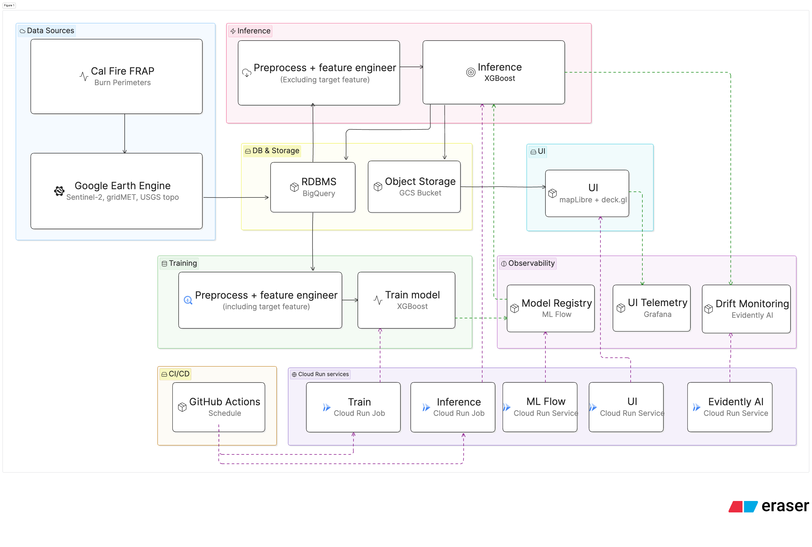
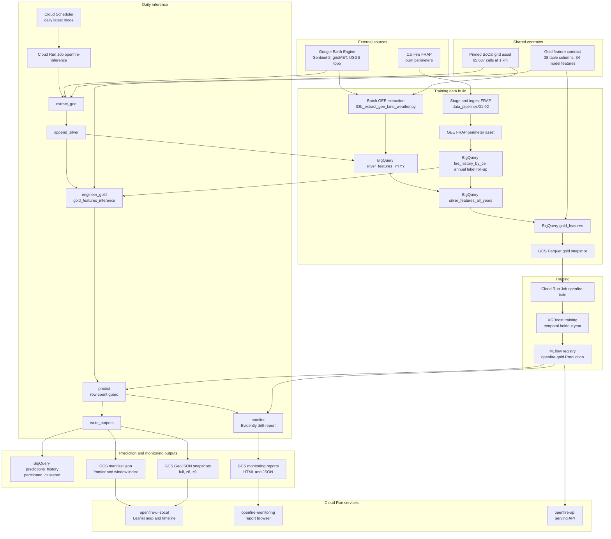

# OpenFire Architecture

End-to-end data flow, component responsibilities, durable contracts, and the
main design decisions behind the OpenFire ML pipeline.



The diagram above is the high-level view. The mermaid source below is kept as
the editable source of truth — render it if you want to extend or regenerate
the diagram.

---

## System Overview



---

## Core Contracts

- **AOI and grid:** production scope is Kern, Los Angeles, San Luis Obispo,
  and Santa Barbara counties. Both training and inference load the pinned GEE
  FeatureCollection asset
  `projects/${GCP_PROJECT_ID}/assets/socal_4county_grid_v1`, which contains
  `65,687` canonical 1 km cells. Dynamic `coveringGrid` is only a fallback for
  non-production AOIs.
- **Date grid:** feature windows follow the 5-day cadence anchored at
  `2017-09-01`. Inference modes reject off-grid window dates.
- **Gold schema:** `gold_features` and `gold_features_inference` intentionally
  carry the same 38-column schema. The model feature vector uses the 34 columns
  in `src/pipelines/train.py::FEATURE_COLUMNS`, excluding
  `window_start_date`, `latitude`, `longitude`, and
  `burned_in_next_15_days`.
- **Row-count invariant:** the inference orchestrator requires exactly `65,687`
  rows from `gold_features_inference` and exactly `65,687` prediction rows
  before writes continue.
- **Prediction table:** `predictions_history` is partitioned by
  `window_start_date` and clustered by integer `lat_bin`/`lon_bin` because
  BigQuery cannot cluster on `FLOAT64` latitude/longitude columns.
- **Manifest invariant:** `manifest.json` is monotonic for the latest frontier.
  Older-window reruns update the sorted `windows` index without regressing
  `latest_window_start_date`.

---

## Component Responsibilities

### Data Ingestion And Feature Engineering

| Step | Responsibility |
|---|---|
| `01_stage_calfire_data.py` | Download Cal Fire FRAP data, stage bronze GDB/zip files, convert perimeters to EPSG:4326 shapefiles in GCS. |
| `02_ingest_calfire_gee.py` | Ingest staged FRAP shapefiles into a GEE FeatureCollection asset. |
| `03b_extract_gee_land_weather.py` | Batch extractor for training data. For each 5-day window, sample Sentinel-2, gridMET, and topography over the pinned grid and append to `silver_features_YYYY`. |
| `04_merge_silver_years.sql` | Merge yearly silver tables, deduplicate, remove GEE `system:index`, and join `fire_history_by_cell`. |
| `05_engineer_gold_features.sql` | Build `gold_features`: target, `days_since_last_burn`, and 5/15/30/60-day lag deltas. |
| `06_export_gold_to_gcs.sql` | Export `gold_features` to SNAPPY Parquet shards for training. |
| `07_create_inference_tables.sql` | Create inference-side `gold_features_inference` and `predictions_history` tables without destructive DDL. |
| `07_engineer_inference_gold.sql` | Engineer one inference window from recent silver rows and MERGE into `gold_features_inference`. |
| `08_freeze_grid.py` | One-shot utility that creates the pinned GEE grid asset for a named AOI. |

Key implementation details:

- GEE masked Sentinel-2 pixels are exported as `-9999` so BigQuery receives
  typed floats instead of schema-breaking null strings.
- `fire_history_by_cell` is the annual per-cell roll-up of FRAP fire dates used
  for labels and `days_since_last_burn`. Regenerate it after each new FRAP
  vintage before rebuilding training gold data.
- The training gold SQL still uses string-cast latitude/longitude partitions
  for historical lag windows. The inference gold SQL normalizes coordinate
  keys with `FORMAT("%.6f", lat/lon)` after the 2026 row-count incident. Aligning
  the training SQL before the next full retraining build is a backlog item.
- The 60-day lag warm-up filter removes rows where `ndvi_change_60d IS NULL`.

### Training

`src/pipelines/train.py` reads the exported Parquet snapshot with column
pushdown and float32 downcast to keep peak memory under the Cloud Run training
job limits. It performs a temporal year split, trains XGBoost with
`scale_pos_weight = negatives / positives`, logs metrics and plots to MLflow,
saves a `model.joblib` bundle, and promotes the registered `openfire-gold`
model version to Production when registration is enabled.

The BigQuery `gold_features` table is the training source of truth. The Parquet
files are a versioned training snapshot optimized for pandas/XGBoost reads, not
an independent feature store.

### Inference

`src/pipelines/run_inference_pipeline.py` supports three modes:

| Mode | Use |
|---|---|
| `--mode latest` | Scheduler path. Query `MAX(window_start_date)` from `predictions_history` and catch up to the most recent ready grid date. |
| `--mode backfill --start YYYY-MM-DD --end YYYY-MM-DD` | Historical population or reprocessing over a date range. |
| `--mode window --date YYYY-MM-DD` | One exact grid-aligned window for smoke tests and manual reruns. |

Per-window step chain:

```text
extract_gee -> append_silver -> engineer_gold -> load_model -> predict -> write_outputs -> monitor -> log_summary
```

All steps are designed to be idempotent at the window level. If GEE extraction
and silver append are already complete, the standard recovery pattern is to
resume from `engineer_gold`:

```bash
python -m src.pipelines.run_inference_pipeline \
  --mode backfill --start 2026-01-07 --end 2026-04-17 \
  --from-step engineer_gold
```

### Output Writer

`src/pipelines/output_writer.py` writes three prediction outputs per window:

1. `predictions_history`: partition-scoped `WRITE_TRUNCATE` into
   `predictions_history$YYYYMMDD`.
2. Gzipped GeoJSON snapshots:
   `predictions_YYYYMMDD.geojson`,
   `predictions_YYYYMMDD_z8.geojson`, and
   `predictions_YYYYMMDD_z9.geojson`.
3. `manifest.json`: latest frontier plus sorted `windows` metadata, including
   available `geojson_variants`.

`scripts/rebuild_manifest_from_bucket.py` can rebuild the manifest index from
existing snapshots. `scripts/backfill_snapshot_variants.py` can create missing
historical `z8`/`z9` variants without rerunning GEE, BigQuery inference, or
model scoring.

### Monitoring

The inference `monitor` step compares each current
`gold_features_inference` window against a sampled training reference using
Evidently OSS `0.7.21` via the `evidently.legacy.*` API. It writes:

- `gs://${OPENFIRE_GCS_BUCKET}/monitoring/reports/report_YYYYMMDD.html`
- `gs://${OPENFIRE_GCS_BUCKET}/monitoring/snapshots/snapshot_YYYYMMDD.json`
- `gs://${OPENFIRE_GCS_BUCKET}/monitoring/index.json`

The `openfire-monitoring` Cloud Run service is read-only. It lists historical
reports, serves report HTML, and exposes `/summary/latest`.

### SoCal Frontend

`frontend-socal/` is a static Leaflet viewer served by the
`openfire-ui-socal` Cloud Run service. `src/ui_socal/app.py` serves the static
files and proxies `/data/*` to private prediction objects in GCS using the
runtime service account, so the browser does not need bucket CORS or public
GCS reads.

`frontend-socal-deckgl/` is a standalone deck.gl prototype static root. It
reuses the same FastAPI static/proxy service code, manifest contract, `/data/*`
proxy, timeline model, and UI telemetry envelope, but it is packaged with
`docker/Dockerfile.ui_socal_deckgl` and deploys to the separate
`openfire-ui-socal-deckgl` Cloud Run service through a manual workflow. Its
runtime `OPENFIRE_UI_VARIANT` is `deckgl-scatterplot`, so BigQuery and Faro can
compare it side by side with production `leaflet-canvas` without replacing the
Leaflet service.

Current UI behavior:

- Reads `/data/manifest.json`.
- Builds a timeline from `manifest.windows`.
- Fetches full, `z8`, or `z9` snapshots depending on zoom and manifest support.
- Falls back to deterministic client-side downsampling for older manifests.
- Supports play/pause, arrow-key navigation, LRU snapshot caching, neighbor
  prefetch, render-mode display, collapsible panels, and adaptive point styling.
- Tracks client-side snapshot load, render, paint, and long-task timings in a
  collapsible Performance panel and `window.OPENFIRE_SOCAL_PERFORMANCE`.
- Sends batched UI performance telemetry to `/metrics/ui/performance`, grouped
  by `ui_variant` so Leaflet, deck.gl, MapLibre, or other prototypes can be
  compared in the same backend table.
- Serves `/metrics/ui/dashboard`, a BigQuery-backed dashboard that ranks UI
  variant, event, and render-mode groups by P95 paint, load, render, and frame
  wait timings.
- Serves `/runtime-config.js` so Cloud Run environment settings can configure
  browser-safe observability flags without rebuilding static assets.
- Loads Web Vitals field measurement from the browser and stores those events
  in the same UI performance table.
- Records uncaught browser errors and unhandled promise rejections in the same
  telemetry envelope with sanitized error metadata and a stack hash, not raw
  stack traces.
- Optionally initializes Grafana Faro Cloud when
  `OPENFIRE_FARO_COLLECTOR_URL` is configured. The same OpenFire-specific map
  timings are exported as Faro custom measurements so the Grafana dashboard can
  rank UI bottlenecks without replacing the BigQuery telemetry baseline.
- Temporarily excludes `2025-12-23` and `2025-12-28` from the timeline while
  those low-count historical snapshots are investigated.

For read-only UI testing against the real inference dataset, run the same
FastAPI UI service with telemetry disabled and the live manifest enabled:

```bash
OPENFIRE_SOCAL_STATIC_ROOT=frontend-socal-deckgl \
OPENFIRE_UI_VARIANT=deckgl-scatterplot-readonly \
OPENFIRE_UI_PERF_ENABLED=false \
OPENFIRE_WEB_VITALS_ENABLED=false \
OPENFIRE_FARO_ENABLED=false \
OPENFIRE_USE_LIVE_MANIFEST=true \
uvicorn src.ui_socal.app:app --host 127.0.0.1 --port 8090
```

That mode still reads `gs://${OPENFIRE_GCS_BUCKET}/predictions/manifest.json` and referenced
snapshots through `/data/*`, but it does not emit UI performance, Web Vitals, or
Faro telemetry. The checked-in three-window demo manifest should remain only as
an offline fallback and fixture for deterministic unit tests.

---

## Cloud Infrastructure

| Resource | Purpose | Notes |
|---|---|---|
| Cloud Run Job `openfire-inference` | Daily/latest and manual inference runs | 4 vCPU / 16 GiB, `parallelism=1`, `max-retries=0`. |
| Cloud Run Job `openfire-train` | XGBoost training | 8 vCPU / 32 GiB, `max-retries=0`. |
| Cloud Run Service `openfire-api` | Existing serving API | Managed by `cd.yml`. |
| Cloud Run Service `openfire-ui-socal` | SoCal prediction viewer and GCS proxy | 1 vCPU / 256 MiB, scale to zero, managed by `ui_socal.yml`. |
| Cloud Run Service `openfire-ui-socal-deckgl` | Standalone deck.gl UI prototype and GCS proxy | 1 vCPU / 512 MiB, scale to zero, manual blue/green prototype workflow. |
| Cloud Run Service `openfire-monitoring` | Evidently report dashboard | Read-only GCS report browser, managed by `monitoring.yml`. |
| Cloud Scheduler `openfire-inference-daily` | Daily inference trigger | Runs `openfire-inference` with baked `--mode latest` args. |
| MLflow server | Experiment tracking and registry | Registry name: `openfire-gold`. |
| BigQuery dataset `openfire_features` | Silver, gold, inference, prediction tables | Project configured by deployment environment. |
| BigQuery table `openfire_features.ui_performance_events` | Browser UI performance telemetry | Partitioned by `received_at`, clustered by UI variant, event, window, and render mode. |
| GCS bucket `${OPENFIRE_GCS_BUCKET}` | Gold Parquet, predictions, monitoring artifacts | Prediction objects live under `gs://${OPENFIRE_GCS_BUCKET}/predictions/`. |

IAM notes:

- The SoCal UI runtime service account needs read-only GCS access to the
  prediction objects. It also needs BigQuery write/query permissions for
  `ui_performance_events` if live UI telemetry and dashboarding are enabled:
  dataset-level `WRITER` ACL access, or an equivalent
  `roles/bigquery.dataEditor` dataset IAM binding where supported, plus
  `roles/bigquery.jobUser` on the project. The GitHub deployer also needs
  `roles/iam.serviceAccountUser` on that runtime service account for
  `gcloud run deploy --service-account`.
- The Scheduler service account has `roles/run.invoker` for the inference job.
  Do not add an HTTP `overrides` block to the Scheduler body unless the account
  also receives `run.jobs.runWithOverrides`.

---

## Training And Inference Alignment

The systems should share contracts and feature logic, but not the same physical
gold table.

| Concern | Training | Inference | Decision |
|---|---|---|---|
| Feature source | BigQuery `gold_features`, exported to Parquet | BigQuery `gold_features_inference` | Keep separate write surfaces; align schema and tests. |
| Gold writes | Deliberate full rebuild via training data pipeline | Per-window MERGE | Inference must never write to `gold_features`. |
| GEE extraction | Batch tasks over historical windows | Per-window extraction inside orchestrator | Share AOI/grid/extraction helpers where practical. |
| Lag engineering | Full historical table rebuild | 60-day lookback for one target window | Reuse SQL fragments or generated CTEs where possible. |
| Model input | 34 feature columns from Parquet snapshot | Same 34 feature columns from BQ window read | Enforce with bundle/schema parity tests. |
| Output | Model bundle and MLflow registry | BQ predictions, GeoJSON snapshots, manifest, monitoring | Keep outputs separate. |

Best-practice direction:

- Treat BigQuery gold tables as authoritative feature data and Parquet as a
  reproducible training snapshot.
- Keep inference's separate gold table because it limits blast radius and makes
  backfills idempotent.
- Reduce training-serving skew through shared AOI/grid definitions, shared
  feature-column constants, SQL parity tests, and a small shared feature
  engineering contract.

---

## UI Performance Options

Current production path is Leaflet Canvas plus gzipped full/`z8`/`z9` GeoJSON
snapshots. That is the lowest-risk baseline for the current 65k-cell SoCal
viewer.

UI performance telemetry contract:

- Browser clients emit batched `ui_performance_v1` events to
  `/metrics/ui/performance`.
- Each UI implementation must set a stable `ui_variant`, such as
  `leaflet-canvas`, `deckgl-scatterplot`, or `maplibre-mvt`.
- Events measure user-visible phases: snapshot load, render, paint readiness,
  frame wait, rendered point count, zoom, cache hit, and render mode.
- Web Vitals events use the same session, variant, and app-version envelope and
  record metric name, value, delta, rating, and navigation type.
- Browser error events use the same envelope and store error type, truncated
  message/source, line/column, and stack hash so BigQuery remains the durable
  backup for Grafana's shorter-retention error view.
- Grafana Faro Cloud is an optional second sink. When enabled, the browser loads
  the Faro Web SDK from the configured CDN URL, sends Faro's automatic frontend
  observability signals to Grafana Cloud, and pushes OpenFire map timings as
  `openfire_ui_interaction` custom measurements.
- The telemetry contract does not store client IP addresses or raw user-agent
  strings; it stores an anonymous session ID plus viewport, device, and network
  summary fields needed for performance analysis.
- The dashboard at `/metrics/ui/dashboard` groups by `ui_variant`, event, and
  render mode so prototypes can be compared over the same live traffic window.

Browser observability runtime configuration:

| Variable | Purpose |
|---|---|
| `OPENFIRE_UI_VARIANT` | Stable variant label for comparisons. Current default: `leaflet-canvas`. |
| `OPENFIRE_UI_VERSION` | Build or release label attached to browser telemetry. |
| `OPENFIRE_WEB_VITALS_ENABLED` | Enables the Web Vitals browser library. Default: `true`. |
| `OPENFIRE_FARO_COLLECTOR_URL` | Grafana Cloud Frontend Observability collector URL copied from the Grafana application setup page. When absent, Faro stays disabled. |
| `OPENFIRE_FARO_ENVIRONMENT` | Grafana environment label, such as `production` or `staging`. |

Programmatic Grafana Cloud reads use `scripts/query_grafana_faro.py`, which
queries the Loki `/loki/api/v1/query_range` endpoint with
`GRAFANA_CLOUD_LOKI_URL`, `GRAFANA_CLOUD_LOKI_USER`, and
`GRAFANA_CLOUD_LOKI_TOKEN` from local environment or the ignored `.env` file.
The Loki token must be stored as a secret, not as browser config.

| Option | Pros | Cons | Feasibility |
|---|---|---|---|
| Continue Leaflet Canvas optimization | Lowest risk; already deployed; works with current static/proxy architecture; precomputed variants reduce low-zoom load. | Browser still parses GeoJSON; full-detail zoom can remain marker-heavy. | Low difficulty. Best for short-term polish. |
| Add deck.gl `ScatterplotLayer` overlay | WebGL point rendering, strong pan/zoom performance for large point sets, built-in picking path, can later use binary attributes. | Adds frontend dependency and tooltip/event rewrite; network and JSON parse costs remain unless data format changes too. | Medium difficulty. Best next measured prototype. |
| Migrate to MapLibre GL JS with PMTiles/MVT | Tiled static delivery, style expressions, renderer-managed culling, best path for larger AOIs or higher resolution. | Larger rewrite; requires tile generation, style migration, and proxy/range behavior decisions. | Medium-high difficulty. Best long-term scale path. |
| Use FlatGeobuf viewport reads | Cloud-optimized binary vector format with spatial index and HTTP range reads; useful for viewport-only reads from object storage. | More custom integration; needs renderer pairing; Cloud Run proxy must preserve Range semantics well. | Medium-high difficulty. Consider after deck.gl/MapLibre evaluation. |

Recommended order: collect the current Leaflet baseline from the built-in
browser performance tracker and `/metrics/ui/dashboard`, prototype deck.gl for
risk points with a distinct `ui_variant`, then choose whether the project needs
the larger MapLibre + PMTiles/MVT migration.

---

## Known Limitations And Model Disclosures

- **FRAP label staleness:** `days_since_last_burn` depends on annual FRAP burn
  perimeters. Inference windows after the latest FRAP release can treat cells
  that recently burned as unburned.
- **Single-year validation:** current model validation uses a single holdout
  year. It prevents temporal leakage but does not provide confidence intervals
  across years.
- **AOI scope:** current Production model and UI are scoped to the four-county
  SoCal AOI. Out-of-AOI predictions are out-of-distribution.
- **Resolution:** current Production model uses a 1 km grid. Moving to 250 m or
  20 m requires new data-volume, sampling, validation, and UI delivery choices.
- **Cloud/no-data quality:** high cloud cover can produce sentinel-heavy
  Sentinel-2 features. Prediction outputs do not yet carry row-level feature
  quality flags.
- **Probability calibration:** `risk_probability` is the model's continuous
  score, but the current XGBoost bundle is not yet calibrated as an empirical
  probability.
- **Class imbalance:** fire events are extremely rare. Precision, PR AUC, and
  binary `predicted_label` must be interpreted against that base rate.
